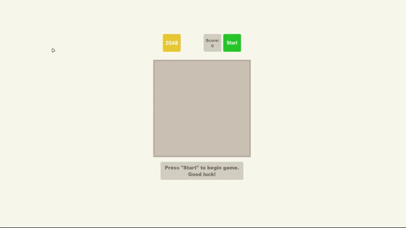

# 2048 Game

Welcome to the 2048 Game!

This project is a recreation of the classic and addictive 2048 puzzle game. Whether you're a seasoned player or a newcomer to the world of 2048, this game is designed to provide hours of challenging fun.


## Technologies Used
This project leverages modern web technologies to provide a smooth and enjoyable gaming experience:

- **HTML:** A simple skeleton markup to structure the game's interface.
- **BEM (Block Element Modifier):** A methodology to maintain modular and reusable CSS classes, ensuring the game's styles are easy to manage and extend.
- **SCSS:** Syntactically Awesome Style Sheets are used to write cleaner and more maintainable CSS, enabling better organization and modularization of styles.
- **JavaScript:** The core logic of the game, including tile movements, merging logic, and game state management, is implemented in JavaScript.
## Demo

Click the button below to experience the 2048 Game:

[DEMO](https://julwer1k.github.io/2048_game/)


## Run Locally

This project uses Node.js 14. Switching to it ensures compatibility with project dependencies. Refer to [Node.js download](https://nodejs.org/en/blog/release/v14.21.3) for installation instructions.

Clone the project

```bash
  git clone https://github.com/julwer1k/2048_game.git
```

Go to the project directory

```bash
  cd 2048_game
```

Install dependencies

```bash
  npm install
```

Start the server

```bash
  npm run start
```

Check linter [HTML, JavaScript, CSS]

```bash
  npm run lint
```
